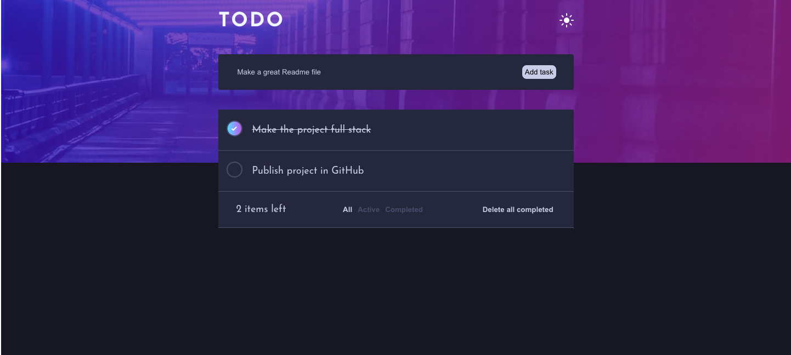
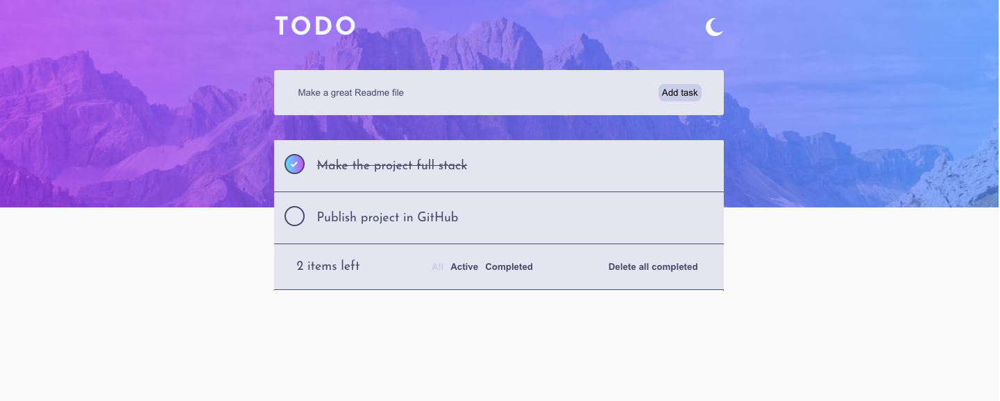
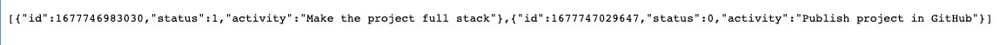

# To-do application

This is my "for-fun" project. The project is based on a [Frontend Mentor](https://www.frontendmentor.io/challenges/todo-app-Su1_KokOW) challange that includes dark and light theme switch, adding, checking, filtering and deleting tasks.

I approched the challange as a full-stack project, the front-end is written in React.js and the [back-end](https://github.com/SanderPalk/todo-api) is written in node.js.

For saving data I didn't opt for any database but decided to use [node.js file system module](https://www.w3schools.com/nodejs/nodejs_filesystem.asp) for easier project setup and reusability.

 
# Project set-up
For both front and back-end main requirement is installed [Node.js and npm](https://nodejs.org/en/download/)
## Front-end
Download the project from [this resporitory](https://github.com/SanderPalk/todo-app)

Open the terminal in project directory
- run ```npm install```
- run ```npm start```

After than you should see React app running on http://localhost:3000/

Right now only working functionallity is toggle between the dark and light mode, to get the whole application working move on to the back-end section.


## Back-end
Download the project from [this resporitory](https://github.com/SanderPalk/todo-app-backend)

Open the terminal in project directory
- run ```npm install```
- run ```npm start```

After than you should see empty array on http://localhost:3001/

Now the whole application should be working with all included functionallity (toggle theme, add/check/filter/delete tasks)

If you don't see anything when you open http://localhost:3000/, head to the **front-end** section


# Project pictures
### Dark theme application

### Light theme application

### API

